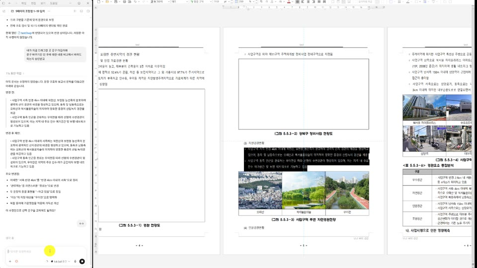
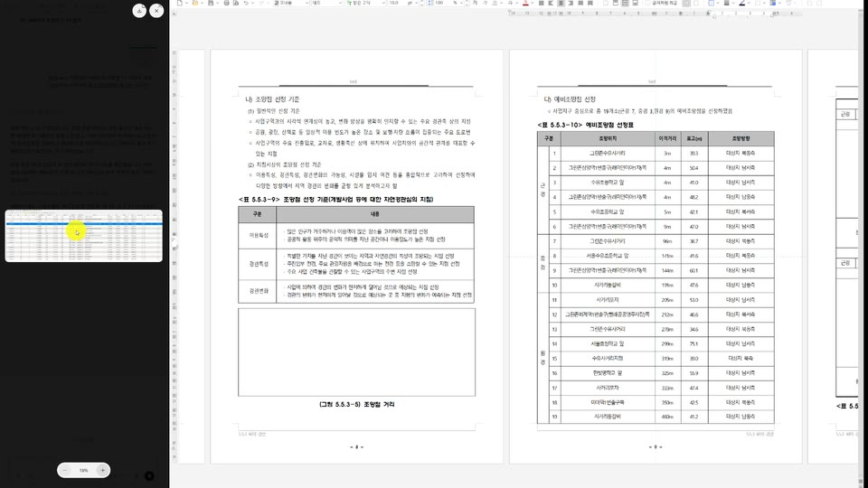
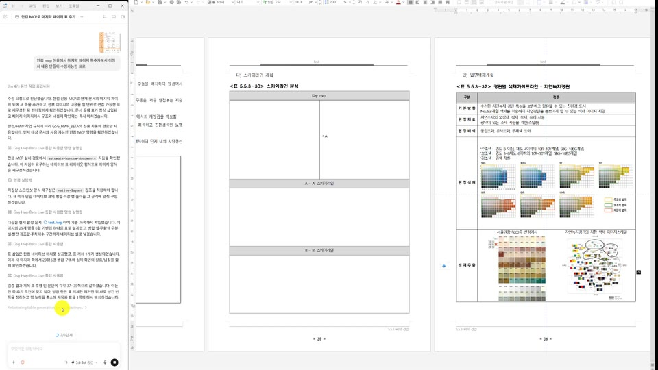
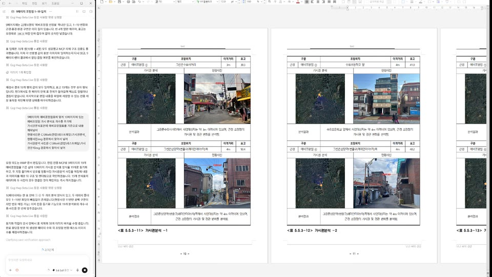

# GSG HWP

GSG HWP는 **Codex, Claude Code 같은 에이전트 앱이 Windows 한/글에서 현재 열려 있는 HWP 문서를 빠르게 조회하고 네이티브 방식으로 편집·검수하도록 연결하는 로컬 MCP**입니다.

- 배포 버전: **v1.2.1**
- 원본 소스 버전: `0.5.73-dev.3`
- MCP 런타임: `0.3.91`
- C++ 네이티브 브리지: `0.5.124`
- 네이티브 프로토콜: `12`
- 개발자: **inodesign**
- 공개 도구: 업무 도구 44개 + 런타임 재로드 1개 = 총 45개
- 공식 API 카탈로그: 1,452개 중 네이티브 라우팅 1,448개

버전별 변경사항은 [CHANGELOG.md](CHANGELOG.md)에 기록합니다.

배포본 해시 검증, 코드 서명 현황, 백신 오탐 대처는 [docs/release-integrity.md](docs/release-integrity.md)를 참고하십시오.

### v1.2.1 주요 변경

- 표를 반복하고 내용을 채우는 작업이 5분 넘게 실패하던 것을 고쳤습니다. 캡션을 확인하려고 표 개수만큼
  문서를 다시 읽던 것을 쪽 단위로 묶었습니다. 사용자 문서 실측에서 40초에 완료되고 되돌리기 호출이
  한 번도 발생하지 않았습니다.
- 큰 표에서 선택한 셀 범위를 읽지 못하면 "셀 주소를 지정해 다시 요청하라"고 답하던 것을 없앴습니다.
  그 문구를 받은 에이전트가 없는 주소를 만들어내 엉뚱한 칸을 고치고 있었습니다. 선택과 표 구조로
  푸는 경로가 이미 있었는데 그 앞에서 막고 있었습니다.
- 셀 서식을 유지해 달라는 요청이 무시되어 서식이 사라지던 문제를 고쳤습니다.
- 라벨만 보고 크기가 같은 무관한 표를 같은 묶음으로 판단해 덮어쓰던 문제를 고쳤습니다. 이제 표별로
  확인하고, 어느 표인지 확정할 수 없으면 그 사실을 알립니다.
- 되돌리기로 원래 상태를 복구한 뒤에도 "변경됨"으로 보고하던 것, 검증 근거가 부족한 것을 검증 실패와
  같이 다루던 것을 고쳤습니다. 성공한 편집이 실패로 보고되면 에이전트가 되돌린 뒤 다시 시도합니다.
- 바뀐 쪽 범위를 커서 위치 한 쪽만 알려주던 것을 실제로 바뀐 범위로 바꿨습니다.
- 모든 네이티브 호출이 내부 통신을 세 번씩 하고 있던 것을 한 번으로 줄였습니다.
- 표 채우기가 네이티브의 일괄 검증을 스스로 꺼뜨리던 문제를 고쳤습니다. 이제 한 칸이라도 내용이
  달라졌으면 아무 칸도 쓰지 않습니다.
- 셀 병합·나누기가 주소를 반드시 요구하던 것을 완화했습니다. 이미 선택해 둔 칸이 있으면 그대로 씁니다.
- 파이썬과 네이티브가 서로 다른 한계값을 믿고 있던 곳들을 맞췄습니다. 50x50 표를 만들 수 없던
  제한도 함께 풀었습니다.

### v1.2.0 주요 변경

- 큰 표를 다룰 때 한/글이 응답하지 않던 문제를 해결했습니다. 1,000칸 채우기가 180초 제한을 넘겨
  16분 넘게 멈추던 것에서 약 60초에 완료되고, 직후 저장·문서 닫기·다음 작업이 모두 동작합니다.
- 원인은 칸마다 표 구조를 다시 읽던 것이었습니다. 같은 표를 다루는 동안 한 번만 읽어 재사용하고,
  큰 요청은 여러 번의 제한된 호출로 나눕니다.
- 표를 바꿀 수 있는 명령 뒤에는 캐시된 표 구조를 버립니다. 종전에는 두 명령만 그렇게 해서 행·열을
  지우거나 넣은 뒤 엉뚱한 칸에 쓸 수 있었습니다.
- 식별자로 지목한 표를 문서 전체에서 찾습니다. 종전에는 커서가 있는 쪽에서만 찾아, 다른 쪽의 표를
  지목하면 "일치하는 표가 없습니다"로 실패했습니다.
- 참조 레이아웃이 셀 소유자를 전체 순회로 찾던 것을 색인 조회로 바꿨습니다.
- 아무것도 바꾸지 않은 실패를 부분 변경으로 보고하지 않고, 파일이 쓰이고 검증된 저장을 실패로
  보고하지 않습니다. 저장을 확정하는 조건 자체는 바꾸지 않았습니다.
- 공식 API 제외 목록이 다시 어긋나 있던 것을 v1.0.4와 같은 4개로 되돌렸습니다.
- `hwp_format_table`에 셀 여백 인자 4개를 optional로 추가했습니다.
- `repeat_header`는 받되 적용하지 않습니다. 적용했을 때 표의 둘째 쪽이 비는 문제가 확인되어
  되돌렸습니다. v1.1.0과 같은 동작입니다.
- GitHub 이슈 #4·#5·#6은 이번 빌드에서 각각 3회 재현 검증으로 해결을 확인했습니다.

### v1.1.0 주요 변경

- 제공된 FULL `0.5.73-dev.1` 소스를 기준으로 Python MCP, C++/ATL 소스와 생산 바이너리를 빠짐없이 교체했습니다.
- 참고 이미지 분석, 편집 가능한 네이티브 레이아웃 생성·수정, 사전 배치 검사와 작업 상태 조회 기능을 포함했습니다.
- GitHub `main`에 새 배포 버전을 올리면 검증 후 Release와 `latest.json`을 만드는 자동 배포 워크플로를 추가했습니다.
- 설치된 MCP는 6시간 간격으로 GitHub Release를 확인하고, SHA-256 검증과 자체 테스트를 통과한 버전만 자동 적용합니다.
- 초기 설치와 모든 업데이트는 시스템 Python이 아니라 `%LOCALAPPDATA%\GSG_HWP\runtime\<버전>\.venv`의 **uv 관리 Python 3.12**만 사용합니다.
- 업데이트 직전 DLL·HKCU 레지스트리·활성 버전 상태도 별도로 백업하며 `restore-update.ps1`로 직전 버전, `uninstall.ps1`로 최초 설치 전 상태를 복원할 수 있습니다.

### v1.0.4 주요 변경

- 공식 API 사례 번호가 분류별로 부여되는데도 전역 순번으로 해석하던 오류를 수정했습니다.
- 실제 검증 실패 4개를 `SaveHistoryItem`, `IHwpObject.ExportStyle`, `IHwpObject.ImportStyle`, `IDHwpParameterArray.Clone`으로 바로잡았습니다.
- 정상 Action인 `CharShapeTextColorGreen`, `CharShapeTextColorRed`, `MakeIndex`를 다시 네이티브 라우팅에 포함했습니다.
- MCP·네이티브 바이너리와 DLL·레지스트리 설치 및 원상복구 동작은 변경하지 않았습니다.

### v1.0.3 주요 변경

- GSG HWP 자체 소스코드와 해당 소스에서 빌드한 실행 파일을 MIT License로 공개했습니다.
- `pyhwpx`를 포함한 Python 직접 의존성과 한컴 Automation의 별도 권리 범위를 `THIRD_PARTY_NOTICES.md`에 정리했습니다.
- 한컴 Automation의 상업적 이용에는 한글과컴퓨터의 별도 승인과 라이선스가 필요하다는 점을 명시했습니다.
- v1.0.2의 MCP 38개, 네이티브 브리지와 설치 전 백업·원상복구 동작은 변경하지 않았습니다.

## 어떤 MCP인가요?

이 프로젝트는 HWP 파일을 원격 서버에 업로드하는 서비스가 아닙니다. 에이전트 앱이 로컬 `stdio` MCP를 실행하고, 같은 Windows 사용자 세션에서 이미 열려 있는 한/글 문서에 연결합니다. 키보드·마우스 자동화나 화면 좌표 클릭 대신 한컴의 공식 Automation 객체와 한/글 프로세스 내부의 네이티브 DLL을 사용합니다.

주요 작업은 다음과 같습니다.

- 문서, 쪽, 표, 셀, 그림, 캡션, 스타일과 선택 영역 조회
- 표 채우기·행 확장·템플릿 복제·표 시리즈 생성
- 셀 병합·분할·크기·테두리·여백·정렬 설정
- 이미지 삽입·교체·셀 안 비율 유지 배치
- 선택 텍스트 교체와 글자·문단 서식 적용
- 페이지·개체 삭제, 실행 취소·다시 실행
- Excel 표와 보고서 레이아웃 추가
- `CreatePageImage` 기반 페이지 렌더 검수
- 사용자가 명시한 경우에만 저장·재열기 검증

## 실제 동작 영상

아래 영상은 실제 에이전트 채팅과 한/글 문서 편집 과정을 담은 **무편집 원본 화면 녹화**입니다. 썸네일이나 `원본 MP4 재생`을 누르면 브라우저에서 전체 영상을 볼 수 있습니다.

| 기존 내용 바꾸기 (1분 7초) | 문서 내용 채우기 (1분 47초) |
|---|---|
| [](https://cdn.jsdelivr.net/gh/innae1121-bit/gsghwp@741d53fd504c09100107fd2e784684b1f8388c9f/docs/media/%EB%82%B4%EC%9A%A9%EB%B0%94%EA%BE%B8%EA%B8%B0.mp4) | [](https://cdn.jsdelivr.net/gh/innae1121-bit/gsghwp@741d53fd504c09100107fd2e784684b1f8388c9f/docs/media/%EB%82%B4%EC%9A%A9%EC%B1%84%EC%9A%B0%EA%B8%B0.mp4) |
| 기존 내용을 검토하고 변경안을 적용하는 과정<br>[원본 MP4 재생](https://cdn.jsdelivr.net/gh/innae1121-bit/gsghwp@741d53fd504c09100107fd2e784684b1f8388c9f/docs/media/%EB%82%B4%EC%9A%A9%EB%B0%94%EA%BE%B8%EA%B8%B0.mp4) | 문서 구조를 확인한 뒤 비어 있는 내용을 채우는 과정<br>[원본 MP4 재생](https://cdn.jsdelivr.net/gh/innae1121-bit/gsghwp@741d53fd504c09100107fd2e784684b1f8388c9f/docs/media/%EB%82%B4%EC%9A%A9%EC%B1%84%EC%9A%B0%EA%B8%B0.mp4) |

| 이미지로 표 만들기 (4분 56초) | 표 내용·사진 채우기 (1분 4초) |
|---|---|
| [](https://cdn.jsdelivr.net/gh/innae1121-bit/gsghwp@741d53fd504c09100107fd2e784684b1f8388c9f/docs/media/%EC%9D%B4%EB%AF%B8%EC%A7%80%EB%A1%9C%ED%91%9C%EB%A7%8C%EB%93%A4%EA%B8%B0.mp4) | [](https://cdn.jsdelivr.net/gh/innae1121-bit/gsghwp@741d53fd504c09100107fd2e784684b1f8388c9f/docs/media/%ED%91%9C%EB%82%B4%EC%9A%A9,%EC%82%AC%EC%A7%84%EC%B1%84%EC%9A%B0%EA%B8%B0.mp4) |
| 이미지 자료를 바탕으로 한/글 표를 구성하는 과정<br>[원본 MP4 재생](https://cdn.jsdelivr.net/gh/innae1121-bit/gsghwp@741d53fd504c09100107fd2e784684b1f8388c9f/docs/media/%EC%9D%B4%EB%AF%B8%EC%A7%80%EB%A1%9C%ED%91%9C%EB%A7%8C%EB%93%A4%EA%B8%B0.mp4) | 표의 내용과 관련 사진을 함께 채우는 과정<br>[원본 MP4 재생](https://cdn.jsdelivr.net/gh/innae1121-bit/gsghwp@741d53fd504c09100107fd2e784684b1f8388c9f/docs/media/%ED%91%9C%EB%82%B4%EC%9A%A9,%EC%82%AC%EC%A7%84%EC%B1%84%EC%9A%B0%EA%B8%B0.mp4) |

## C++/ATL 네이티브 구조

핵심은 Python에서 한/글 문서를 직접 COM 호출하는 구조가 아니라, **한/글 프로세스 내부에 로드되는 Win32 C++ UserAction DLL과 ATL 기반 `IDispatch` 배치 객체**입니다.


구성요소별 역할은 다음과 같습니다.

| 구성요소 | 역할 |
|---|---|
| `HancomMcpLauncher.exe` | MCP Python 프로세스를 현재 데스크톱 사용자 토큰으로 시작해 열린 한/글과 같은 ROT를 보게 합니다. |
| Python MCP 프록시·워커 | 도구 스키마, 대상 선택, 상태 토큰, 작업 recipe, 결과 변환과 핫리로드를 담당합니다. |
| `HancomEventBridge.exe` | 등록 없이 한컴 Automation 이벤트를 받아 문서 변경 시 조회 캐시를 무효화합니다. |
| `HancomLiveBridge.dll` | 한/글 프로세스에 로드되는 Win32 UserAction DLL입니다. `IHwpObject`를 받아 ROT에 게시합니다. |
| `FilePathCheckerModule.dll` | 한컴 Automation이 로컬 파일 경로 접근을 허용하도록 `RegisterModule`에서 사용하는 사용자별 파일 경로 보안 모듈입니다. |
| ATL 배치 객체 | `Snapshot`, `InspectPageV3`, `InspectStructure`, `ExecuteActions` 등을 한/글 프로세스 안에서 실행합니다. |

UserAction DLL은 실행 중인 한/글이 넘겨준 `IHwpObject`를 `!HancomLiveBridge.<PID>`로, ATL 배치 객체를 `!HancomLiveBatch.<PID>`로 ROT에 게시합니다. 문서를 새로 열거나 복사해서 조작하지 않고 사용자가 열어 둔 정확한 문서 인스턴스를 대상으로 합니다.

## 한컴 문서 구조를 빠르게 조회하고 편집하는 방법

한/글 문서는 단순한 화면 픽셀 모음이 아닙니다. 본문은 구역·문단·글자 위치로 구성되고, 표·그림·캡션·자동 번호·머리말 같은 요소는 연결된 컨트롤과 각자의 ParameterSet을 가집니다. GSG HWP는 먼저 이 구조를 네이티브로 읽고, 화면 좌표가 아닌 **문서 ID와 개체 `instance_id`**를 기준으로 편집합니다.

### 1. 가장 작은 빠른 조회 선택

| 필요한 정보 | 내부 조회 방식 | 공개 도구 |
|---|---|---|
| 쪽 텍스트, 컨트롤, 표 앵커, 크기 | `InspectPageSummary` / `InspectPageV3` | `hwp_inspect_page_fast` |
| 표 셀 주소·값·병합 범위 | `InspectPageV3(include_cells)` | `hwp_inspect_page_fast(include_cells=true)` |
| 커서, 선택, 현재 글자·문단 서식 | `Snapshot` | `hwp_inspect` |
| 쪽을 넘는 표, 중첩 개체, 캡션, 자동 번호 | `InspectStructure` | `hwp_inspect_structure` |
| 문서 안의 실제 스타일 ID·이름 | 네이티브 스타일 조회 | `hwp_list_styles` |
| 실제 보이는 결과 | `IHwpObject.CreatePageImage` | `hwp_render_page` |

`InspectRoutingContext`는 지정한 쪽 또는 현재 쪽의 컨트롤·앵커 요약을 셀 순회 없이 한 번에 반환합니다. `InspectPagesV3`는 여러 쪽을 요청해도 문서 전체 컨트롤 연결 목록을 한 번만 순회합니다. 같은 문서 변경 revision에서는 최대 32개의 쪽/모드 조회가 캐시되며, MCP 편집이나 외부 한/글 변경 이벤트가 발생하면 즉시 무효화됩니다.

### 2. 구조 ID를 작업 대상으로 재사용

빠른 조회가 반환한 최상위 `instance_id`는 다시 화면에서 찾지 않고 그대로 편집 대상에 사용합니다.

- `hwp_add_caption`, `hwp_replace_image`, `hwp_fill_table`: `target_id`에 직접 전달
- `hwp_format_table`, `hwp_merge_table_cells`, `hwp_split_table_cell`: `target: {"target_id": "..."}`로 전달
- `hwp_delete_control`: `control_instance_ids`에 전달

쪽 번호는 앞쪽 편집으로 바뀔 수 있지만 컨트롤 ID와 구조 정보는 더 정확한 대상 앵커가 됩니다.

### 3. 쓰기 직전 상태 검증

네이티브 `ExecuteActions`는 작업 전에 문서 ID, 전체 경로, 예상 커서·선택, 원문, 상태 토큰과 이미지 경로를 검증합니다. 사용자가 그 사이 문서를 바꿨으면 오래된 계획을 그대로 실행하지 않고 다시 조회하도록 실패시킵니다.

### 4. 공식 API로 한 번에 실행

검증된 작업은 C++ 브리지 안에서 다음 경로로 실행됩니다.

- `RUN`: 공식 HAction 이름 실행
- `ACTION`: HAction + HParameterSet의 정확한 값 실행
- `CALL`: 문서화된 `IHwpObject` 메서드 호출
- 검증된 복합 명령: 표 복사·붙여넣기, 셀 이동, 병합, 캡션, 그림 삽입 등

표 복제는 Windows 클립보드 UI가 아니라 한컴의 공식 메모리 블록 경로를 사용하고, 삽입된 새 컨트롤의 실제 ID를 다시 확인합니다. 이미지 크기는 경계 상자로 다루며 원본 종횡비를 보존합니다.

### 5. 구조와 렌더를 함께 검수

작업 후 셀 주소·병합·크기·개체 ID는 구조 조회로 확인하고, 잘림·넘침·간격·이미지 왜곡 같은 시각 결과는 `CreatePageImage` 렌더로 확인합니다. 구조값을 스크린샷에서 추측하지 않습니다.

## 공식 API 1,452개와 현재 라우팅 제외 4개

배포본에는 2025-04 한컴 공식 자료에서 생성한 1,452개 API 사례 카탈로그가 포함되어 있습니다. 네이티브 런타임은 그중 **1,448개 사례를 라우팅**하며 아래 4개는 현재 제외합니다.

| case ID | 공식 API | 기능 | 현재 상태 |
|---|---|---|---|
| `action:0608` | `HAction.SaveHistoryItem` | 새 버전으로 저장 | 실제 수정 문서와 `VersionInfo` 입력 후에도 `Execute`/`Run` 네이티브 예외로 실패 |
| `automation:0067` | `IHwpObject.ExportStyle` | 스타일 내보내기 | 공식 TLB 슬롯과 유효 `HStyleTemplate/HSet` 입력에서도 `0xD0000005`로 실패 |
| `automation:0068` | `IHwpObject.ImportStyle` | 스타일 가져오기 | 공식 TLB 슬롯과 유효 `HStyleTemplate/HSet` 입력에서도 `0xD0000005`로 실패 |
| `automation:0365` | `IDHwpParameterArray.Clone` | ParameterArray 복제 | 런타임 객체가 공식 인터페이스를 제공하지 않아 `E_NOINTERFACE`로 실패 |

`1,448개 라우팅`은 `1,448개의 MCP 도구가 화면에 노출된다`는 뜻이 아닙니다. 실제 운영 표면은 작업 중심 도구 44개와 재로드 도구 1개로 제한합니다. 모든 API를 각각 도구로 노출하면 도구 스키마가 지나치게 커지고, AI가 비슷한 도구 사이에서 헤매며, 선택·전송·추론 병목이 생길 수 있기 때문입니다.

원하는 기능이 공개 도구에 없더라도 내부 카탈로그와 네이티브 라우트에 대응 기능이 이미 있는 경우가 많습니다. 다음처럼 에이전트에게 **필요한 기능 하나만** 연결해 달라고 요청할 수 있습니다.

> GSG HWP에서 `원하는 기능`이 현재 공개 도구에 없다. 패키지의 공식 API 카탈로그와 1,448개 네이티브 라우트를 검색하고, 대응 API가 있으면 전체 API를 노출하지 말고 이 기능만 작업 중심 공개 도구 또는 recipe로 연결해줘. 대상·상태 검증, 결과 검수, 회귀 테스트와 compatibility-manifest도 함께 갱신해줘.

대부분은 전용 연결을 추가할 수 있지만, 카탈로그에 있다는 사실만으로 사용 중인 한/글 버전과 현재 커서·선택·문서 상태에서 항상 성공하는 것은 아닙니다. 구현 에이전트가 실제 API 서명, ParameterSet, 안전 조건과 검증 방법을 함께 확인해야 합니다.

## 지원 환경

- Windows 10 또는 Windows 11
- 한컴오피스 한/글 2024
- Codex 데스크톱/CLI, Claude Code 또는 로컬 stdio MCP를 지원하는 에이전트 앱
- Git
- `uv` 패키지 관리자
- `uv`가 내려받고 관리하는 Python 3.12를 버전별 `.venv`에 격리하여 사용

배포 ZIP에는 개발자의 `.venv`나 일반 Python 설치본을 넣지 않습니다. `install.ps1`이 `uv sync --managed-python`으로 `%LOCALAPPDATA%\GSG_HWP\runtime\1.2.1\.venv`를 새로 만들며, 시작 스크립트는 그 안의 `Scripts\python.exe`만 실행합니다. PC에 별도로 설치된 시스템 Python 3.12는 선택하거나 수정하지 않습니다.

네이티브 UserAction DLL, 파일 경로 보안 모듈과 Event Bridge는 `Win32`, 런처는 `x64` Release 빌드입니다. 다른 한/글 주버전·비트 조합은 별도 검증 전까지 지원 대상으로 간주하지 않습니다.

## 한컴 파일 경로 보안 모듈

한컴 Automation은 문서를 읽거나 저장하기 전에 `RegisterModule("FilePathCheckDLL", "FilePathCheckerModule")`로 파일 경로 보안 모듈을 등록해야 합니다. 이 값이 없는 깨끗한 PC에서는 MCP 도구가 정상 로드되어도 문서 연결 단계에서 `한컴 파일 경로 보안 모듈 등록이 거부되었습니다` 오류가 발생합니다.

v1.0.1부터 설치기는 잠금된 `pyhwpx==1.6.6` 환경에 포함된 `FilePathCheckerModule.dll`의 SHA-256을 확인한 뒤 `%LOCALAPPDATA%\GSG_HWP\security\FilePathCheckerModule.dll`로 복사하고, 현재 사용자 레지스트리의 `HKCU\Software\HNC\HwpAutomation\Modules`에 같은 이름으로 등록합니다. 한컴 설치 폴더, HKLM, `regsvr32`와 관리자 권한은 사용하지 않습니다.

기존 `FilePathCheckerModule` 값이나 같은 대상 DLL이 있으면 먼저 존재 여부·레지스트리 종류·값·원본 파일을 백업합니다. 제거할 때는 기존 항목을 정확히 복원하고, 원래 없었다면 GSG HWP가 추가한 항목만 제거합니다.

## 에이전트에게 GitHub 주소만 주고 설치하기

### Codex에 요청

> https://github.com/innae1121-bit/gsghwp.git 를 설치해줘. 먼저 README.md와 AGENTS.md를 읽고, 변경되는 DLL 2개·HKCU 레지스트리 3개 값·백업 위치·자동 업데이트·직전 버전 및 최초 상태 복구 방법을 나에게 안내해. install.ps1을 옵션 없이 실행해 미리보기를 보여준 뒤 설치를 진행하고, 전용 uv 관리 `.venv`가 생성됐는지 확인하고 gsg-hwp 플러그인을 등록해서 새 작업에서 MCP 도구를 확인해줘.

### Claude Code에 요청

> https://github.com/innae1121-bit/gsghwp.git 를 설치해줘. README.md와 CLAUDE.md를 먼저 읽고 DLL·레지스트리 백업/복원, 자동 업데이트와 전용 `.venv` 내용을 안내한 뒤 install.ps1 미리보기와 실제 설치를 실행해. 마지막에 gsg-hwp stdio MCP를 사용자 범위로 등록하고 연결 상태를 확인해줘.

### 다른 에이전트 앱에 요청

> https://github.com/innae1121-bit/gsghwp.git 를 설치해줘. 저장소의 AGENTS.md를 따르고 install.ps1 미리보기와 백업 안내를 먼저 수행해. 설치 후 `plugins/gsg-hwp/scripts/start-mcp.ps1`을 stdio MCP 명령으로 등록해줘.

## 설치 때 변경되는 항목과 백업

`install.ps1`은 옵션 없이 실행하면 **미리보기만 출력하고 종료 코드 2로 끝납니다.** 실제 변경은 `-AcceptChanges`를 명시했을 때만 수행합니다.

| 항목 | 변경 내용 |
|---|---|
| 네이티브 DLL | `%LOCALAPPDATA%\HancomDocumentAutomation\native\0.5.124\HancomLiveBridge.dll` 복사 또는 교체 |
| 파일 경로 보안 DLL | `%LOCALAPPDATA%\GSG_HWP\security\FilePathCheckerModule.dll` 복사 또는 교체 |
| 레지스트리 1 | `HKCU\Software\HNC\HwpUserAction\Modules`의 `한컴브릿지` 값 |
| 레지스트리 2 | `HKCU\Software\HNC\HwpUserAction\Modules\Uses`의 `한컴브릿지` 값 |
| 레지스트리 3 | `HKCU\Software\HNC\HwpAutomation\Modules`의 `FilePathCheckerModule` 값 |
| 원본 백업 | `%LOCALAPPDATA%\GSG_HWP\backups\<시각-식별자>` |
| 활성 설치 기록 | `%LOCALAPPDATA%\GSG_HWP\state\active-install.json` |
| Python 환경 | `%LOCALAPPDATA%\GSG_HWP\runtime\1.2.1\.venv` |
| 자동 업데이트 상태 | `%LOCALAPPDATA%\GSG_HWP\updater` |
| 내려받은 버전 | `%LOCALAPPDATA%\GSG_HWP\packages\<버전>\gsg-hwp` |

백업에는 다음 정보가 저장됩니다.

- 각 레지스트리 키가 원래 존재했는지
- `한컴브릿지`와 `FilePathCheckerModule` 값이 원래 존재했는지
- 원래 값의 종류(`String`, `DWord` 등)와 실제 값
- 두 대상 경로에 DLL이 원래 있었는지와 기존 DLL 원본

설치는 현재 사용자 영역인 HKCU만 사용합니다. HKLM, `regsvr32`, 관리자 권한은 사용하지 않습니다. 최초 설치는 반드시 `-AcceptChanges`가 있어야 실행됩니다. 이후 MCP 시작 시 자동 업데이트를 확인하며, 새 버전이 있고 한/글이 종료된 상태일 때만 새 DLL과 HKCU 값을 적용합니다. 이때도 직전 상태를 먼저 별도 백업하며 실패하면 기존 버전으로 되돌립니다.

## 자동 업데이트

설치 후 MCP를 시작할 때 다음 순서로 업데이트합니다.

1. 6시간 간격으로 공식 GitHub Release의 `latest.json`을 확인합니다.
2. 버전이 더 높을 때만 태그가 고정된 `gsg-hwp-plugin-v<버전>.zip`을 받습니다.
3. `latest.json`의 SHA-256과 ZIP 내부 경로를 검증합니다. 임의 서버나 `main` 브랜치 ZIP은 실행하지 않습니다.
4. 새 버전 전용 uv 관리 `.venv`를 만들고 MCP import 자체 테스트를 수행합니다.
5. 한/글이 실행 중이면 변경하지 않고 다음 시작까지 보류합니다.
6. DLL·레지스트리 직전 상태를 백업한 뒤 새 버전을 적용합니다. 네트워크 또는 검증 실패 시 현재 버전을 그대로 실행합니다.

자동 업데이트를 끄려면 MCP 클라이언트 환경 변수에 `GSG_HWP_AUTO_UPDATE=0`을 설정합니다. 직전 업데이트만 되돌릴 때는 한/글을 종료한 뒤 다음 명령을 사용합니다.

```powershell
# 미리보기
.\restore-update.ps1

# 직전 자동 업데이트의 DLL·HKCU·활성 패키지 상태 복원
.\restore-update.ps1 -AcceptChanges
```

개발자가 새 버전을 배포할 때는 `.codex-plugin/plugin.json`과 `compatibility-manifest.json`의 배포 버전을 함께 올려 `main`에 반영해야 합니다. `.github/workflows/publish-release.yml`이 안전 QA를 통과한 경우에만 같은 버전의 GitHub Release, 업데이트 ZIP과 `latest.json`을 자동 생성합니다. 버전 번호를 올리지 않은 커밋은 기존 Release를 덮어쓰지 않습니다.

## 수동 설치

설치 전 한/글을 모두 종료합니다.

```powershell
$sourceRoot = Join-Path $env:LOCALAPPDATA "GSG_HWP\source"
git clone https://github.com/innae1121-bit/gsghwp.git $sourceRoot
Set-Location $sourceRoot

# uv가 없을 때만 실행
winget install --id astral-sh.uv -e

# 변경 예정 항목만 표시
.\install.ps1

# 안내를 확인한 뒤 실제 설치
.\install.ps1 -AcceptChanges
```

### Codex 등록

```powershell
codex plugin marketplace add innae1121-bit/gsghwp --ref main
codex plugin add gsg-hwp@gsg-hwp
```

Codex와 한/글을 다시 시작하고 새 작업을 열어 플러그인과 MCP 도구를 로드합니다.

### Claude Code 등록

저장소 루트의 `.mcp.json`은 프로젝트 범위 설정으로 사용할 수 있습니다. 모든 프로젝트에서 쓰려면 저장소 루트에서 다음처럼 사용자 범위에 등록합니다.

```powershell
$startMcp = (Resolve-Path ".\plugins\gsg-hwp\scripts\start-mcp.ps1").Path
claude mcp add --transport stdio --scope user gsg-hwp -- `
  powershell.exe -NoLogo -NoProfile -NonInteractive -ExecutionPolicy Bypass -File $startMcp
claude mcp list
```

Claude Code의 최신 MCP 명령 형식은 [공식 MCP 문서](https://code.claude.com/docs/en/mcp)에서 확인할 수 있습니다.

### 일반 stdio MCP 설정

다른 클라이언트에는 `-File` 뒤 경로를 실제 절대 경로로 바꿔 등록합니다.

```json
{
  "mcpServers": {
    "gsg-hwp": {
      "type": "stdio",
      "command": "powershell.exe",
      "args": [
        "-NoLogo",
        "-NoProfile",
        "-NonInteractive",
        "-ExecutionPolicy",
        "Bypass",
        "-File",
        "<저장소 절대 경로>\\plugins\\gsg-hwp\\scripts\\start-mcp.ps1"
      ]
    }
  }
}
```

## 원상복구와 제거

한/글을 모두 종료한 뒤 실행합니다.

```powershell
Set-Location (Join-Path $env:LOCALAPPDATA "GSG_HWP\source")

# 복원 예정 항목만 표시
.\uninstall.ps1

# 설치 전 DLL과 레지스트리 상태 복원
.\uninstall.ps1 -AcceptChanges
```

앱 등록도 제거합니다.

```powershell
# Codex
codex plugin remove gsg-hwp@gsg-hwp
codex plugin marketplace remove gsg-hwp

# Claude Code
claude mcp remove gsg-hwp
```

설치 전에 네이티브 또는 파일 경로 보안 DLL이 있었다면 각 원본 DLL을 되돌리고, 없었다면 GSG HWP가 추가한 DLL을 제거합니다. 레지스트리 3개 값도 설치 전의 존재 여부·종류·값으로 복원합니다. 복구에 사용한 백업은 감사와 추가 복구를 위해 보존합니다. Python 환경을 남기려면 `uninstall.ps1 -AcceptChanges -KeepRuntime`을 사용합니다.

## 사용 예시

한/글에서 저장된 편집 가능 문서를 연 뒤 자연어로 요청합니다.

```text
현재 열린 HWP 3쪽의 표와 그림 구조를 빠르게 조회해줘.
```

```text
3쪽 표의 머리글을 기준으로 이 records 데이터를 채우고 결과를 렌더 검수해줘.
```

```text
현재 선택한 그림을 새 이미지로 교체하고 종횡비와 셀 안 배치를 확인해줘.
```

```text
선택한 텍스트의 글자 크기와 문단 정렬을 바꾸고 변경 결과만 알려줘.
```

삭제, 저장, 대량 편집은 대상 문서와 범위를 구체적으로 지정하는 것이 안전합니다.

## 저장소 구조

```text
gsghwp/
├─ .agents/plugins/marketplace.json   # GitHub 기반 Codex 마켓플레이스
├─ .github/workflows/publish-release.yml # 버전별 GitHub Release 자동 생성
├─ .mcp.json                          # Claude Code 프로젝트용 stdio 설정
├─ AGENTS.md                          # 범용·Codex 설치/복원 지침
├─ CLAUDE.md                          # Claude Code 설치/복원 지침
├─ README.md                          # 한글 소개, 구조, 사용법
├─ CHANGELOG.md                       # 버전별 변경사항
├─ LICENSE                            # GSG HWP 자체 코드의 MIT License
├─ THIRD_PARTY_NOTICES.md             # 외부 구성요소·한컴·미디어 권리 고지
├─ install.ps1                        # 미리보기, 런타임 설치, DLL/레지스트리 백업·등록
├─ restore-update.ps1                 # 직전 자동 업데이트 상태 복원
├─ uninstall.ps1                      # DLL/레지스트리 원상복구
└─ plugins/gsg-hwp/
   ├─ .codex-plugin/plugin.json       # inodesign 개발자 메타데이터
   ├─ .mcp.json                       # Codex 플러그인 stdio 설정
   ├─ compatibility-manifest.json     # 구성요소 버전·해시·API 범위
   ├─ pyproject.toml / uv.lock        # Python 3.12 의존성 잠금
   ├─ update-policy.json              # 공식 Release 자동 업데이트 정책
   ├─ scripts/                        # 휴대형 MCP 시작, 설치·업데이트 모듈
   ├─ addon/
   │  ├─ HancomLiveBridgeNative/      # C++ UserAction DLL 및 ATL 배치 소스
   │  ├─ HancomEventBridge/           # Win32 이벤트 사이드카
   │  └─ HancomMcpLauncher/           # MCP 사용자 세션 런처
   ├─ skills/                         # HWP 작업 지침, Python MCP 구현, API 카탈로그
   └─ tests/                          # 런타임 회귀 테스트
```

## 라이선스와 권리 범위

- GSG HWP가 자체 작성한 소스코드와 해당 소스에서 빌드한 EXE/DLL은 [MIT License](LICENSE)로 배포됩니다. 저작권 표시는 `Copyright (c) 2026 inodesign`입니다.
- `pyhwpx`, `pywin32` 등 설치되는 외부 패키지는 각 패키지의 원 라이선스를 따릅니다. 정확한 버전과 출처는 [THIRD_PARTY_NOTICES.md](THIRD_PARTY_NOTICES.md)에 기록했습니다.
- `FilePathCheckerModule.dll`은 배포 저장소에 직접 포함하지 않고, 설치 시 고정된 `pyhwpx==1.6.6` 배포 파일에서 가져와 해시를 검증합니다. GSG HWP가 이 DLL의 소유권을 주장하거나 재라이선스하지 않습니다.
- 한/글, HWP, HWPX, 한컴 Automation과 관련 상표·공식 문서의 권리는 각 권리자에게 있습니다. [한컴 공식 안내](https://developer.hancom.com/hwpautomation)에 따라 Automation을 상업적 솔루션에 이용하려면 한글과컴퓨터의 승인과 별도 라이선스가 필요합니다.
- `docs/media/`의 원본 영상과 썸네일은 소개 페이지 열람용이며 MIT 대상이 아닙니다. 별도 허가 없는 복제·수정·재배포 권리는 유보됩니다.

GSG HWP의 MIT License는 자체 코드의 사용·수정·재배포·상업적 이용을 허용하지만, 한컴 또는 다른 제3자의 권리까지 허가하지는 않습니다. 이 프로젝트는 한글과컴퓨터의 공식 제품이 아니며 보증 또는 승인을 받았음을 의미하지 않습니다.

## 개인정보와 배포 정리

- 개발 PC의 가상환경, 캐시, 로그, PDB, OBJ, LIB, EXP와 중간 빌드 산출물을 제외했습니다.
- 개인 업무 문서, 개인 업무 경로와 해당 경로에 종속된 일회성 스크립트를 제외했습니다.
- 배포 EXE/DLL은 로컬 PDB 빌드 경로가 포함되지 않도록 디버그 정보를 끄고 다시 빌드했습니다.
- MCP 시작 경로는 개발자 절대 경로가 아니라 플러그인 상대 경로와 `%LOCALAPPDATA%`를 사용합니다.
- 사용자 문서는 기본적으로 로컬 한/글 프로세스에서 처리됩니다.

## 수동 업데이트

자동 업데이트를 끈 환경이나 저장소 자체를 최신 버전으로 바꾸려는 경우에만 사용합니다.

```powershell
Set-Location (Join-Path $env:LOCALAPPDATA "GSG_HWP\source")
git pull
.\install.ps1
.\install.ps1 -AcceptChanges
codex plugin marketplace upgrade gsg-hwp
codex plugin add gsg-hwp@gsg-hwp
```

활성 설치가 유지되는 동안 최초 설치 전 백업은 덮어쓰지 않습니다. 수동 업데이트도 새 DLL·레지스트리를 적용하기 직전에 복구용 스냅샷을 추가합니다. 업데이트 후 앱을 다시 시작하고 새 작업에서 `hwp_runtime_info`를 확인합니다.

## 문제 해결

- `uv가 필요합니다`: `winget install --id astral-sh.uv -e` 후 새 PowerShell을 엽니다.
- `runtime is incomplete`: 저장소 루트에서 `install.ps1 -AcceptChanges`를 다시 실행합니다.
- `안전 설치가 완료되지 않았습니다`: MCP가 자동 수정하지 않은 정상 보호 동작입니다. 한/글을 닫고 설치 스크립트를 실행합니다.
- 도구가 보이지 않음: Codex는 `codex plugin list`, Claude Code는 `claude mcp list`로 등록 상태를 확인하고 새 작업을 엽니다.
- DLL이 로드되지 않음: 한/글을 완전히 종료한 뒤 다시 실행합니다.
- 복원 실패: 레지스트리를 수동 편집하지 말고 오류에 표시된 백업 폴더를 보존한 채 이슈를 등록합니다.
